# Topology

Updated On: 2026-04-21

## Current Topology

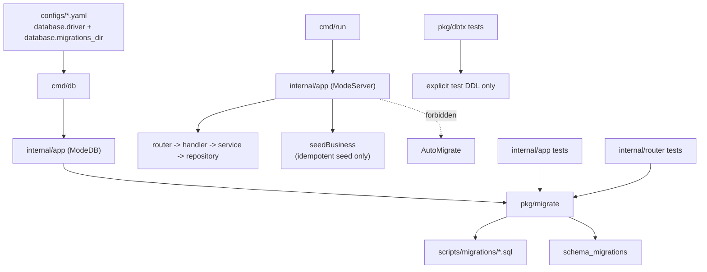

## Schema Source

- Single source of truth:
  `configs/*.yaml(database.migrations_dir) -> cmd/db -> internal/app(ModeDB) -> pkg/migrate -> scripts/migrations/*.sql`
- Server runtime responsibility:
  `cmd/run -> internal/app(ModeServer)` assembles modules, starts the service, and runs idempotent seed logic only.
- Test schema responsibility:
  tests that need the real business schema must use `pkg/migrate + scripts/migrations`; low-level tests that do not depend on business schema may use explicit test DDL.

## App Composition Root

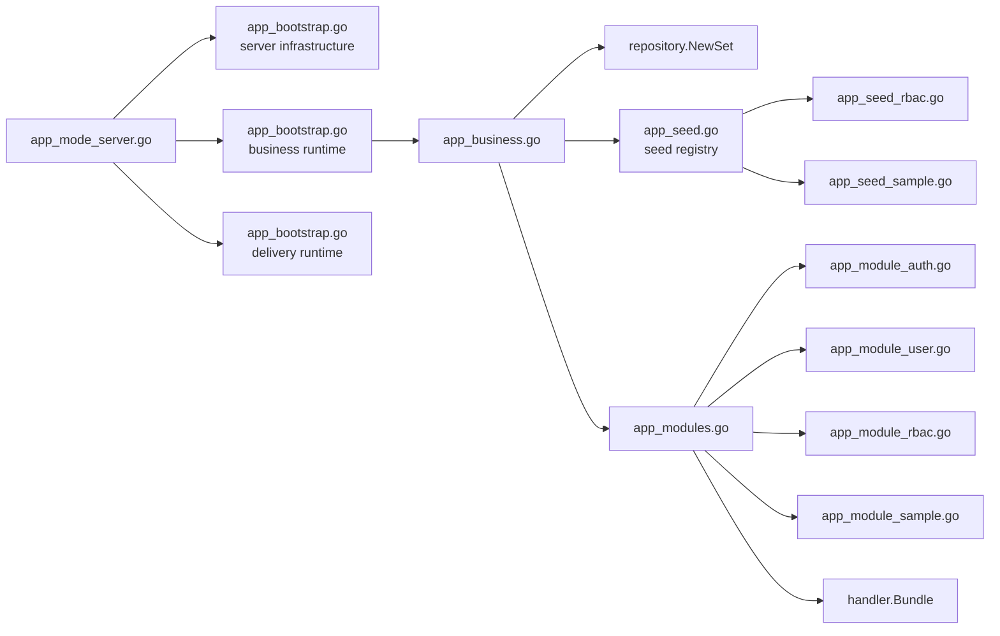

- `internal/app` now owns orchestration and registration, not module internals.
- Startup order is expressed as named bootstrap phases instead of one long mode-specific init sequence.
- `app_seed.go` is now a registry boundary; module-specific seed behavior lives in dedicated seeder files.

## App Lifecycle Boundary

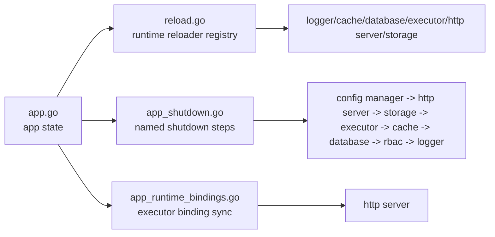

- `app.go` now carries state and construction only.
- Reload and shutdown are no longer embedded as long inline sequences in the main app container file.
- Cross-resource binding is now localized instead of being repeated in multiple init and reload paths.
- Executor binding now targets the HTTP server only; logger no longer assumes the removed legacy async hook.

## Core Infrastructure Integration

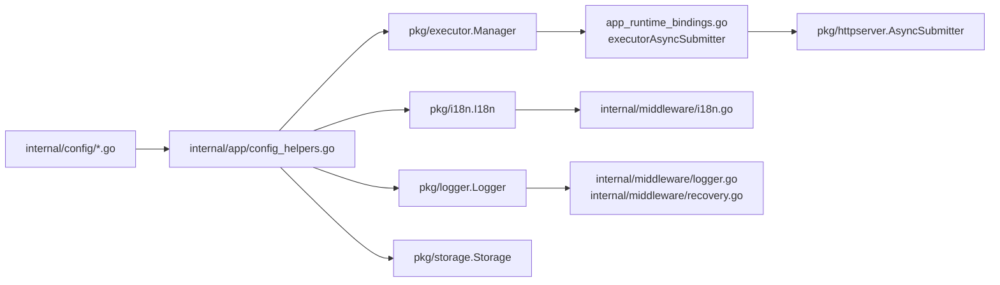

- Compatibility mapping for rewritten infrastructure packages is now isolated in the app composition root.
- Middleware depends on the new logger and i18n interfaces instead of removed concrete manager types.
- The HTTP server receives executor capability through an app-owned adapter rather than a direct package-level type match.

## App Runtime Containers

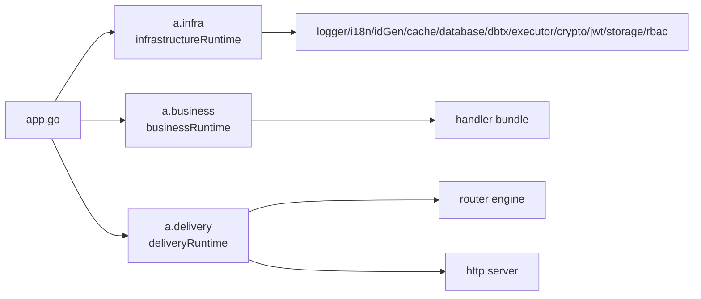

- Runtime state is no longer stored as one flat field list on `App`.
- Infrastructure, business, and delivery concerns now have explicit ownership boundaries inside the app shell.
- Root-app orchestration still exists, but the state it coordinates is now grouped by runtime role.

## App Provisioning Views

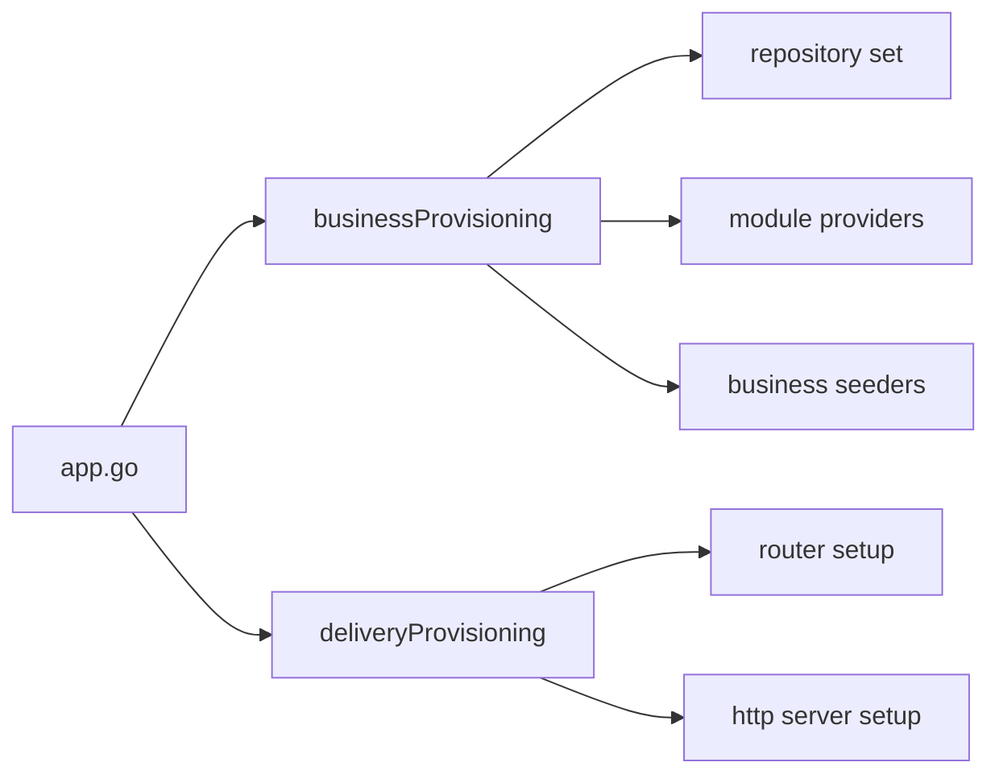

- Module providers and seeders now receive a narrow business assembly surface instead of the full root app object.
- Delivery assembly now reads from a dedicated delivery view instead of directly traversing root-app runtime state.
- Root-app knowledge is now more localized at the composition boundary.

## Infrastructure Provisioning

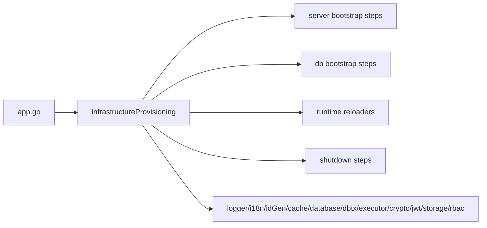

- Root-app orchestration no longer manually chains the infrastructure helper list.
- Infrastructure lifecycle registration now lives behind an app-owned provisioning boundary.
- The infrastructure slice now owns both its long-lived state and the lifecycle sequencing around that state.

## Business And Delivery Bootstrap

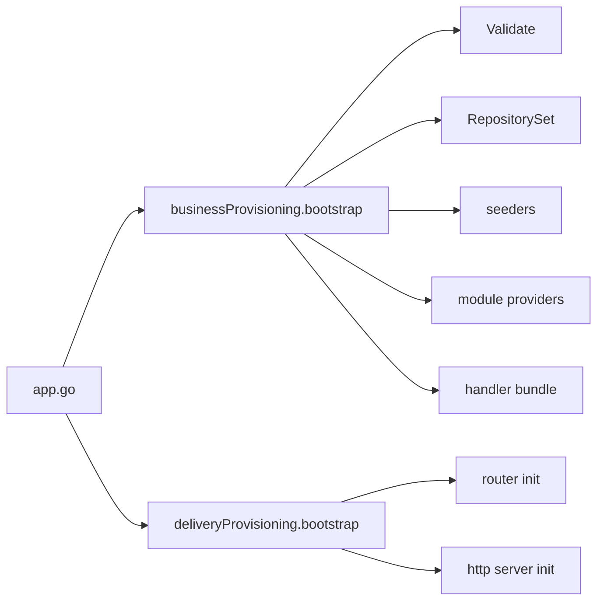

- Business and delivery slices now own their local bootstrap sequences.
- Root-app orchestration coordinates slices, but no longer spells out those slice-local assembly details.
- Slice bootstrap is now aligned with slice-owned runtime state.

## Sample Toolkit Demos

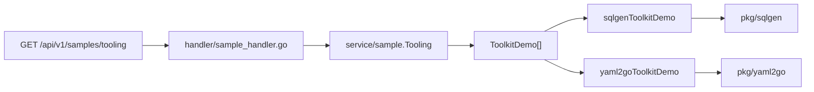

- The sample module now provides business-facing demos for useful pkg helpers that were previously isolated from `internal/`.
- Current demo-backed packages:
  - `pkg/sqlgen`
  - `pkg/yaml2go`
- Explicitly excluded from business demos:
  - `pkg/cli*` because it is CLI-only infrastructure
  - `pkg/i18nold` because it is deprecated legacy code

## User Vertical Slice

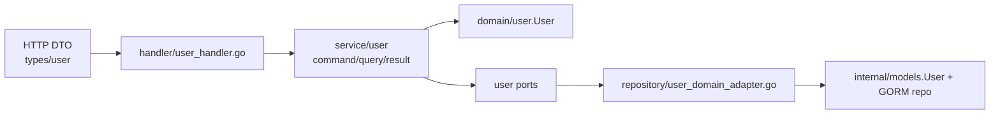

- Status: Completed

## Auth Vertical Slice

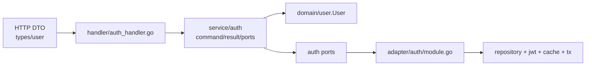

- Status: Completed

## RBAC Vertical Slice

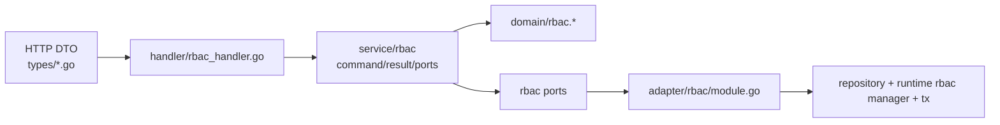

- `handler/rbac_handler.go` owns DTO translation for permission checks, role assignment, role revocation, and policy management.
- `service/rbac` depends on RBAC-specific ports and pure RBAC domain entities.
- `internal/adapter/rbac/module.go` bridges the RBAC usecase to legacy repositories and the existing runtime RBAC manager.
- Status: Completed

## Refactor Strategy

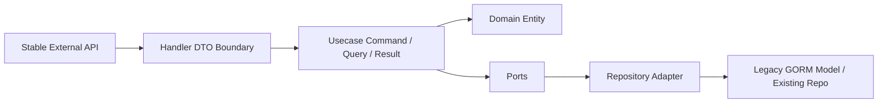

- This is now the standard migration order for future modules.
- Completed slices: `user`, `auth`, `rbac`
- Completed app-layer composition step: module-level providers under `internal/app`
- Completed app-layer startup step: explicit bootstrap phases and module-owned seeders
- Completed app-layer lifecycle step: explicit reload/shutdown boundaries and shared runtime bindings
- Completed app-layer state step: runtime containers for infrastructure, business, and delivery concerns
- Completed app-layer provisioning step: narrow business/delivery views instead of broad root-app coupling
- Completed app-layer infrastructure step: infrastructure lifecycle orchestration delegated to `infrastructureProvisioning`
- Completed app-layer slice orchestration step: business and delivery bootstrap delegated to slice-owned provisioning flows
- Completed platform integration step: rewritten logger/i18n/executor/storage packages are now wired through the current composition root
- Completed isolated tooling step: sample-module demos now cover `pkg/sqlgen` and `pkg/yaml2go`
- Next recommended focus: extract slice-local registration for runtime start/reload/shutdown where those paths still cross back through the root app shell.

## Removed Nodes

- `cmd/initdb`
- `internal/app/app_initdb.go`
- `internal/app/app_initdb_schema.go`
- `internal/app/app_mode_initdb.go`
- `scripts/initdb/`
- runtime `AutoMigrate`
- shared service-layer infrastructure contracts that are no longer used by migrated modules

## Entity Notes

- No new infrastructure library was introduced in this round.
- `auth` continues to reuse `internal/domain/user.User`.
- `rbac` now has explicit pure domain entities under `internal/domain/rbac`.
- Domain entity memory continues to live under `architecture/entities/`.
