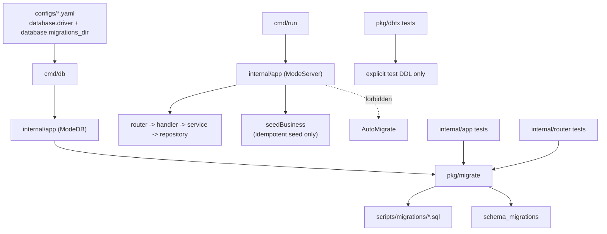
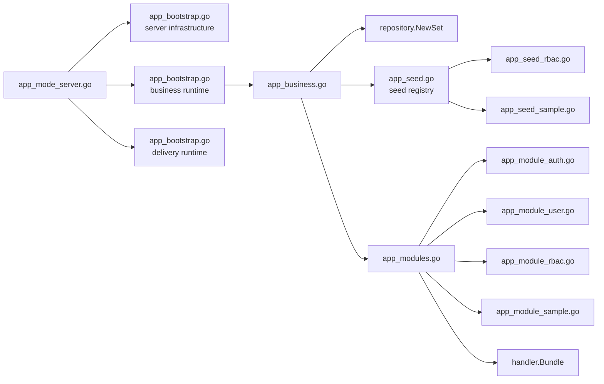
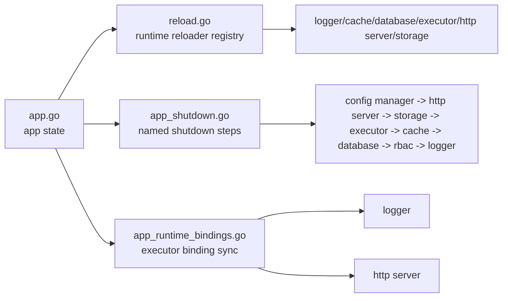
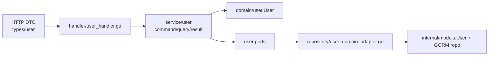
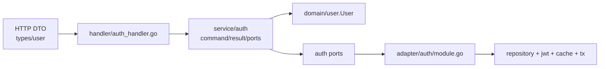
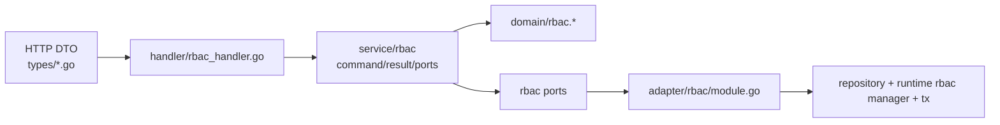
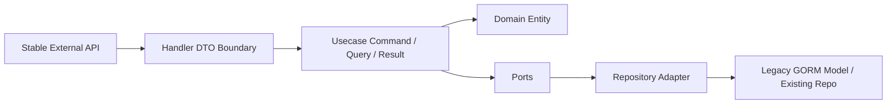

# Topology

Updated On: 2026-04-20

## Current Topology

## Schema Source

- Single source of truth:
  `configs/*.yaml(database.migrations_dir) -> cmd/db -> internal/app(ModeDB) -> pkg/migrate -> scripts/migrations/*.sql`
- Server runtime responsibility:
  `cmd/run -> internal/app(ModeServer)` assembles modules, starts the service, and runs idempotent seed logic only.
- Test schema responsibility:
  tests that need the real business schema must use `pkg/migrate + scripts/migrations`; low-level tests that do not depend on business schema may use explicit test DDL.

## App Composition Root

- `internal/app` now owns orchestration and registration, not module internals.
- Startup order is expressed as named bootstrap phases instead of one long mode-specific init sequence.
- `app_seed.go` is now a registry boundary; module-specific seed behavior lives in dedicated seeder files.

## App Lifecycle Boundary

- `app.go` now carries state and construction only.
- Reload and shutdown are no longer embedded as long inline sequences in the main app container file.
- Cross-resource binding is now localized instead of being repeated in multiple init and reload paths.

## User Vertical Slice

- Status: Completed

## Auth Vertical Slice

- Status: Completed

## RBAC Vertical Slice

- `handler/rbac_handler.go` owns DTO translation for permission checks, role assignment, role revocation, and policy management.
- `service/rbac` depends on RBAC-specific ports and pure RBAC domain entities.
- `internal/adapter/rbac/module.go` bridges the RBAC usecase to legacy repositories and the existing runtime RBAC manager.
- Status: Completed

## Refactor Strategy

- This is now the standard migration order for future modules.
- Completed slices: `user`, `auth`, `rbac`
- Completed app-layer composition step: module-level providers under `internal/app`
- Completed app-layer startup step: explicit bootstrap phases and module-owned seeders
- Completed app-layer lifecycle step: explicit reload/shutdown boundaries and shared runtime bindings
- Next recommended focus: group long-lived app state into narrower runtime containers for infrastructure, business, and delivery concerns.

## Removed Nodes

- `cmd/initdb`
- `internal/app/app_initdb.go`
- `internal/app/app_initdb_schema.go`
- `internal/app/app_mode_initdb.go`
- `scripts/initdb/`
- runtime `AutoMigrate`
- shared service-layer infrastructure contracts that are no longer used by migrated modules

## Entity Notes

- No new infrastructure library was introduced in this round.
- `auth` continues to reuse `internal/domain/user.User`.
- `rbac` now has explicit pure domain entities under `internal/domain/rbac`.
- Domain entity memory continues to live under `architecture/entities/`.
