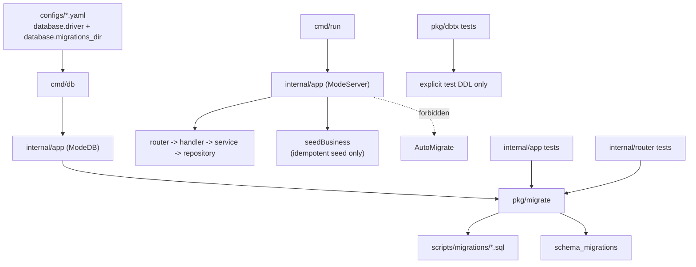

# Topology

更新日期: 2026-04-20

## 当前架构拓扑

## 拓扑说明

- 唯一 Schema 事实源:
  `configs/*.yaml(database.migrations_dir) -> cmd/db -> internal/app(ModeDB) -> pkg/migrate -> scripts/migrations/*.sql`
- 服务启动职责:
  `cmd/run -> internal/app(ModeServer)` 只负责装配应用、启动服务和执行幂等 seed，不再负责建表或修表。
- 测试建库职责:
  需要真实业务 Schema 的测试必须走 `pkg/migrate + scripts/migrations`；不依赖业务 Schema 的底层单测可以使用显式测试 DDL。

## 已移除节点

- `cmd/initdb`
- `internal/app/app_initdb.go`
- `internal/app/app_initdb_schema.go`
- `internal/app/app_mode_initdb.go`
- `scripts/initdb/`
- 运行时 `AutoMigrate`

## 实体层说明

当前这次重构没有引入新的基础库，也没有修改领域实体边界；`architecture/entities/` 下的实体记忆保持不变。
